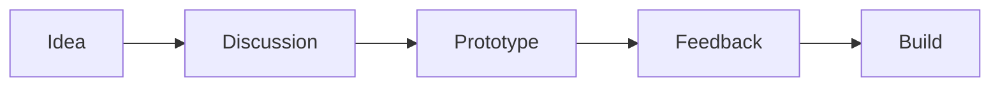

# Exclusive: Behind the Scenes of Our Development Process

**For Followers Only** 👥

Thank you for following us! This post gives you an exclusive look at how we build our products.

## Our Development Workflow

### 1. Ideation Phase
We start with brainstorming sessions where the entire team contributes ideas. Everyone's voice matters!

### 2. Sprint Planning
We use 2-week sprints with daily standups:
- Morning standup at 9 AM
- Code reviews in the afternoon
- Sprint retrospective every Friday

### 3. Tech Stack Insights
Here's what we're currently using:
- **Backend:** Python + FastAPI
- **Frontend:** React + TypeScript
- **Database:** PostgreSQL + Redis
- **Infrastructure:** AWS + Docker + Kubernetes

### 4. Quality Assurance
We maintain high quality through:
- Automated testing (80%+ coverage)
- Code reviews (2 approvals required)
- Staging environment testing
- Beta user feedback

## Sneak Peek: Upcoming Features 🔮

As a follower, you get early access to what's coming:

1. **AI-Powered Search** - Smart search with natural language
2. **Real-time Collaboration** - Multi-user editing
3. **Mobile App** - iOS and Android native apps
4. **Advanced Analytics** - Detailed usage insights

## Join the Beta!

Interested in early access? Reply to this post or email us at beta@example.com

## Q&A Session

We'll be hosting a live Q&A session next week where you can ask anything about our tech stack, processes, or upcoming features.

**Date:** Next Friday, 3 PM PST
**Where:** Discord community channel

---

**Thank you for being a follower!** Your support helps us build better products. 🙏

Have suggestions or feedback? We're all ears! Drop a comment or DM us anytime.
