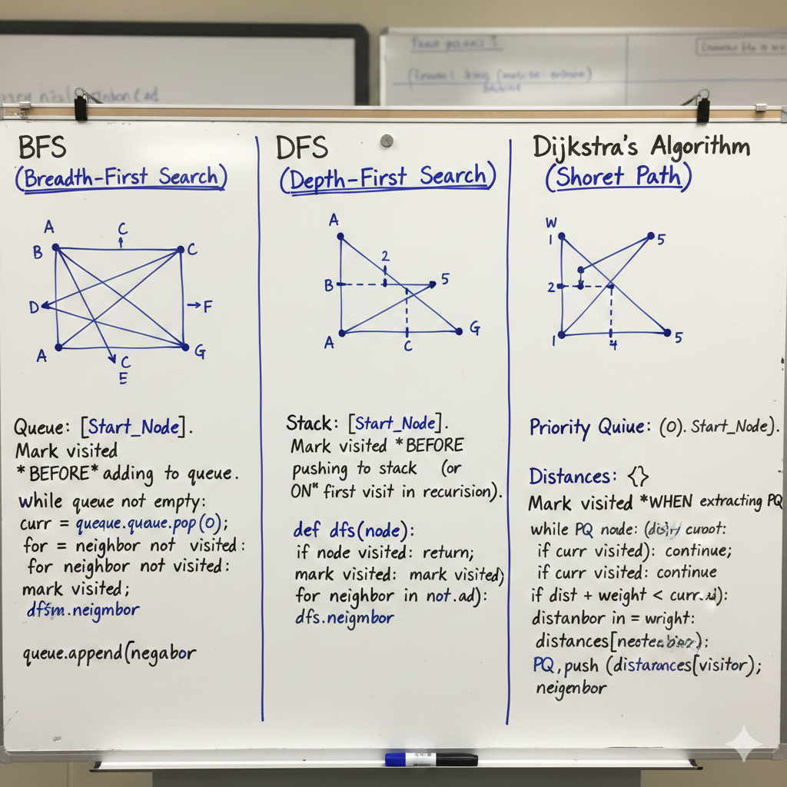
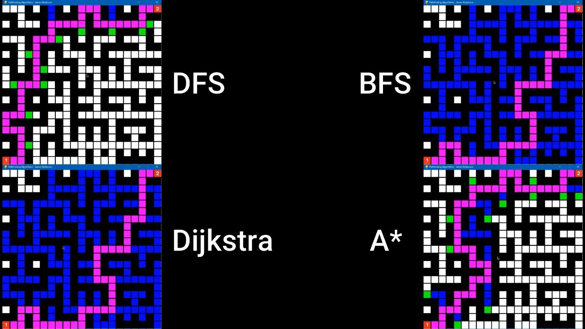

# When to Mark `visited`: BFS, DFS, and Dijkstra Explained Precisely



## Abstract

One of the most common sources of bugs in graph algorithms is marking a node as `visited` at the wrong time. This article explains _exactly_ when and why nodes must be marked visited in **BFS**, **DFS**, and **Dijkstra**, based on their formal correctness invariants—not intuition or convention.

---

## The Core Idea

The timing of `visited` is not an implementation detail. It encodes **what property of the node has become irreversible**.

> A node must be marked `visited` **at the moment the algorithm’s guarantee becomes final**.

Each algorithm has a different guarantee. Therefore, each marks `visited` at a different time.

---

## BFS (Breadth-First Search)

### What `visited` Means

**Visited = discovered**

Once a node is discovered in BFS, the shortest path (in number of edges) to that node is already known.

### Why This Works

- All edges have equal weight
- BFS explores level by level
- The first time a node is reached is optimal

### Correct Invariant

> A node must enter the queue at most once.

### Correct Timing

Mark `visited` **when enqueuing**, not when dequeuing.

### Correct Pattern

```python
if neighbor not in visited:
    visited.add(neighbor)
    queue.append(neighbor)
```

### What Breaks if You Mark Late

- Duplicate enqueues
- Redundant processing
- Potential exponential blowup in dense graphs

---

## DFS (Depth-First Search)

### What `visited` Means

**Visited = entered**

Once DFS enters a node, re-entering it provides no new information and creates cycles.

### Why This Works

- DFS is about coverage, not optimality
- Cycles must be prevented immediately

### Correct Invariant

> A node must never be entered more than once along the active call stack.

### Correct Timing

Mark `visited` **when entering the node** (before recursion).

### Correct Recursive Pattern

```python
def dfs(node):
    visited.add(node)
    for n in node.neighbors:
        if n not in visited:
            dfs(n)
```

### What Breaks if You Mark Late

- Infinite recursion in cyclic graphs
- Exponential revisits in DAGs

---

## Dijkstra’s Algorithm

### What `visited` Means

**Visited = distance finalized**

A node may be discovered multiple times with improving distances. `visited` means no further improvement is possible.

### Why Early Marking Is Wrong

- Edge weights vary
- First discovery is not necessarily optimal
- A later path may be cheaper

### Correct Invariant

> When a node is extracted as the global minimum from the priority queue, its shortest distance is final.

### Correct Timing

Mark `visited` **when the node is popped from the priority queue**.

### Correct Pattern

```python
while pq:
    dist, u = heappop(pq)
    if u in visited:
        continue
    visited.add(u)
    for v, w in graph[u]:
        relax(u, v, w)
```

### What Breaks if You Mark Early

Incorrect shortest paths.

Example:

```
A --10--> B
A --1--> C --1--> B
```

Early marking fixes B at distance 10 and blocks the optimal path of 2.

---

## Comparison Table

| Algorithm | Edge Weights | Meaning of `visited` | When to Mark |
| --------- | ------------ | -------------------- | ------------ |
| BFS       | Equal        | Discovered           | Enqueue      |
| DFS       | Irrelevant   | Entered              | Entry / Push |
| Dijkstra  | Non-negative | Distance finalized   | Min-pop      |

---

## Unifying Rule

All three algorithms follow the same principle:

> **Mark a node visited when the algorithm’s correctness guarantee becomes irreversible.**

- BFS: irreversible at discovery
- DFS: irreversible at entry
- Dijkstra: irreversible at minimum extraction

---

## Final Insight

If you cannot clearly state _what property becomes final when you mark `visited`_, the implementation is likely incorrect.

This is not a stylistic choice.
It is a correctness condition.


